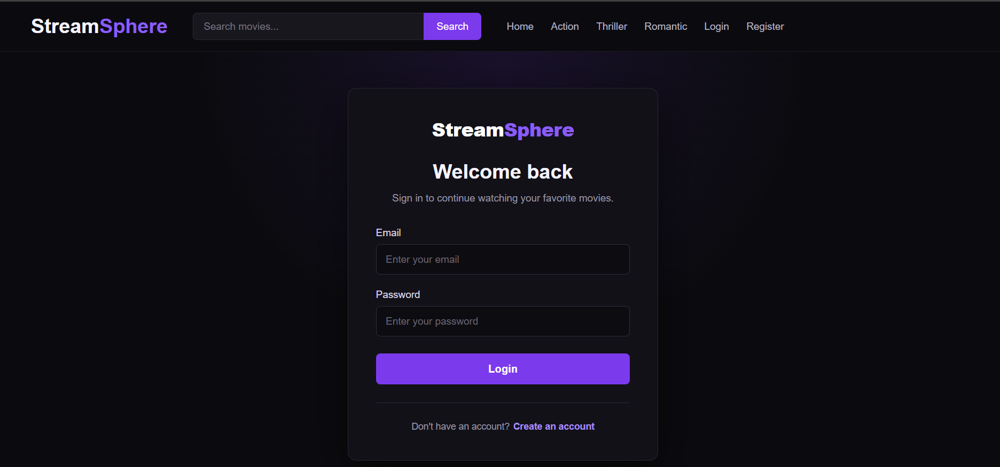
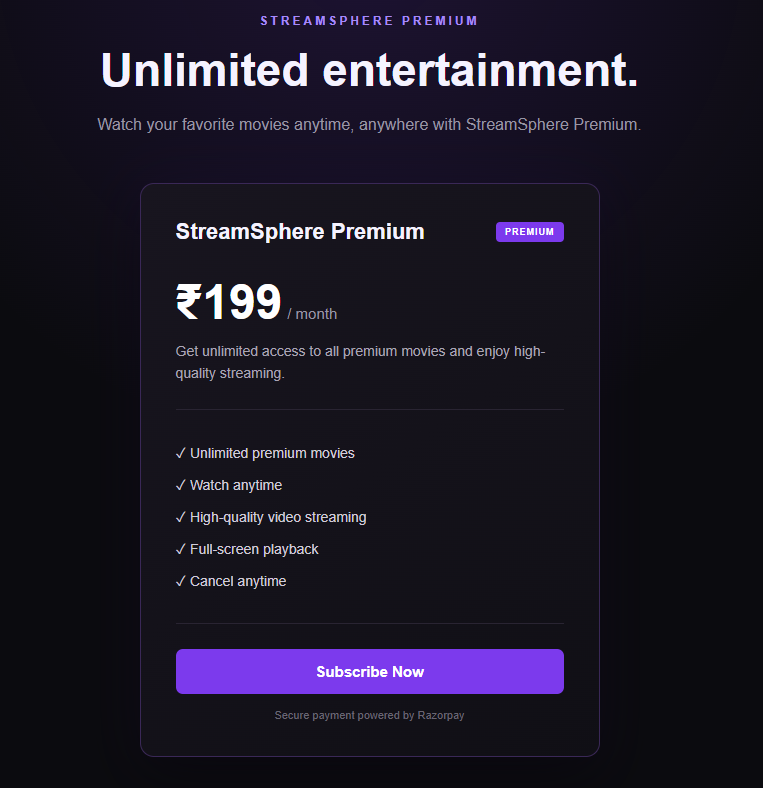
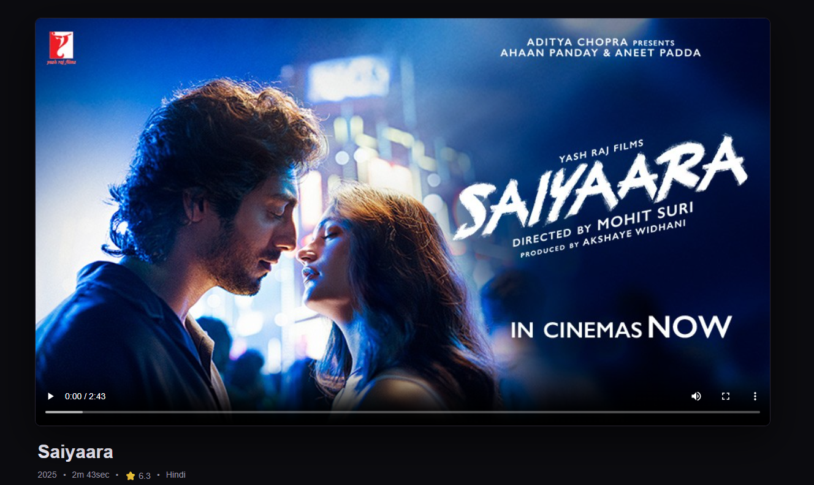

# 🎬 StreamSphere

A full-stack Netflix-inspired video streaming platform built using the MERN stack.

StreamSphere allows users to browse movies, search for content, view movie details, subscribe to premium content using Razorpay, and watch premium videos.

The platform also includes a complete admin panel for managing movies, users, subscriptions, and payments.

---

## 🚀 Live Demo

### Frontend

https://streamsphere-d48u.onrender.com

### Backend API

https://streamsphere-backend-2ehz.onrender.com

---

## 📌 Features

### 👤 User Features

- User registration and login
- JWT-based authentication
- Secure password hashing
- Browse movies without login
- Search movies
- Browse movies by category
- View movie details
- Premium subscription
- Razorpay payment integration
- Subscription status tracking
- Premium movie access
- Video streaming
- Responsive user interface
- Logout functionality

---

### 💳 Subscription & Payment Features

- Premium subscription system
- Razorpay payment integration
- Test payment support
- Secure payment verification
- Payment records stored in MongoDB
- Subscription start date
- Subscription expiry date
- Active subscription status
- Successful payment tracking
- Total revenue calculation
- Admin payment management

---

### 🎬 Movie Features

- Movie listing
- Featured movie
- Trending movies
- Movie categories
- Movie search
- Movie details
- Premium movie access
- Video streaming
- Movie thumbnails
- Movie metadata
- Cloudinary video storage
- Cloudinary image storage

---

### 🛠️ Admin Features

- Admin authentication
- Protected admin routes
- Admin dashboard
- Total users statistics
- Total movies statistics
- Active subscriber statistics
- Successful payment statistics
- Add movies
- Edit movies
- Replace movie thumbnails
- Replace movie videos
- Delete movies
- View all users
- Search users
- View active subscribers
- View successful payments
- View total revenue

---

## 🏗️ Tech Stack

### Frontend

- React.js
- Vite
- React Router DOM
- Axios
- JavaScript
- HTML5
- CSS3

### Backend

- Node.js
- Express.js
- MongoDB
- Mongoose
- JWT
- bcrypt
- Express Validator
- Multer
- CORS

### External Services

- MongoDB Atlas
- Cloudinary
- Razorpay
- Render

---

## 📂 Project Structure

```text
StreamSphere/
│
├── client/
│   ├── public/
│   ├── src/
│   │   ├── components/
│   │   ├── context/
│   │   ├── pages/
│   │   │   └── admin/
│   │   ├── services/
│   │   ├── App.jsx
│   │   ├── index.css
│   │   └── main.jsx
│   ├── package.json
│   └── vite.config.js
│
├── server/
│   ├── src/
│   │   ├── config/
│   │   ├── controllers/
│   │   ├── middlewares/
│   │   ├── models/
│   │   ├── routes/
│   │   ├── services/
│   │   └── utils/
│   ├── app.js
│   ├── server.js
│   └── package.json
│
├── screenshots/
│   ├── home.png
│   ├── login.png
│   ├── register.png
│   ├── movie-details.png
│   ├── subscription.png
│   ├── watch.png
│   ├── admin-dashboard.png
│   ├── admin-movies.png
│   ├── admin-users.png
│   ├── admin-subscribers.png
│   └── admin-payments.png
│
├── .gitignore
└── README.md
```

---

## 🖼️ Screenshots

### Home Page


### Login Page



### Register Page


### Movie Details


### Subscription Page



### Watch Page



### Admin Dashboard


### Movie Management


### User Management


### Active Subscribers


### Successful Payments


---

## ⚙️ Installation

Follow these steps to run StreamSphere locally.

### 1. Clone the Repository

```bash
git clone https://github.com/YOUR_USERNAME/StreamSphere.git
```

Move into the project:

```bash
cd StreamSphere
```

---

### 2. Install Frontend Dependencies

```bash
cd client
npm install
```

---

### 3. Install Backend Dependencies

Open another terminal or go back to the root:

```bash
cd ../server
npm install
```

---

## 🔑 Environment Variables

Environment variables are required for both the frontend and backend.

Never commit actual `.env` files or secret credentials to GitHub.

---

### Backend Environment Variables

Create:

```text
server/.env
```

Example:

```env
PORT=5000

MONGO_URI=your_mongodb_connection_string

JWT_SECRET=your_jwt_secret
JWT_EXPIRES_IN=your_access_token_expiration

CLOUDINARY_CLOUD_NAME=your_cloudinary_cloud_name
CLOUDINARY_API_KEY=your_cloudinary_api_key
CLOUDINARY_API_SECRET=your_cloudinary_api_secret

RAZORPAY_KEY_ID=your_razorpay_key_id
RAZORPAY_KEY_SECRET=your_razorpay_key_secret

CLIENT_URL=http://localhost:5173
```

Replace the placeholder values with your own credentials.

---

## 📚 What I Learned

While developing StreamSphere, the project provided practical experience with:

- Building a MERN stack application
- Designing REST APIs
- Connecting React with Express APIs
- Working with MongoDB and Mongoose
- Implementing JWT authentication
- Implementing role-based authorization
- Hashing passwords using bcrypt
- Handling file uploads with Multer
- Uploading media to Cloudinary
- Integrating Razorpay
- Verifying online payments
- Managing subscription states
- Building an admin dashboard
- Deploying frontend and backend applications
- Using MongoDB Atlas
- Managing environment variables
- Working with Git and GitHub
- Debugging production issues

---

## 🔮 Future Improvements

The following features can be added in future versions:

### 👤 User Features

- User profile management
- Change password
- Forgot password
- Email verification
- Profile pictures

### ❤️ Personalization

- Watchlist
- Favorites
- Watch history
- Continue Watching
- Personalized recommendations

### ⭐ Movie Features

- Movie ratings
- User reviews
- Related movies
- More advanced search
- Advanced filtering
- Multiple languages
- Multiple subtitles

### 💳 Subscription

- Multiple subscription plans
- Monthly and yearly plans
- Subscription cancellation
- Subscription renewal
- Payment invoices
- Subscription notifications

### 📊 Admin

- Advanced analytics
- Revenue charts
- User growth charts
- Movie performance analytics
- Pagination for admin tables
- Advanced filtering
- Content scheduling

### 📧 Notifications

- Email notifications
- Payment confirmation emails
- Subscription expiry reminders
- New movie notifications

### 🎥 Streaming

- Video quality selection
- Subtitles
- Multiple audio tracks
- Continue playback from last position
- Adaptive video streaming

---

## 👨‍💻 Author

**Raghavendra Nelagali**

Full-Stack Developer | React | Node.js | Express | MongoDB

---

## 📄 License

This project is created for learning, portfolio, and demonstration purposes.